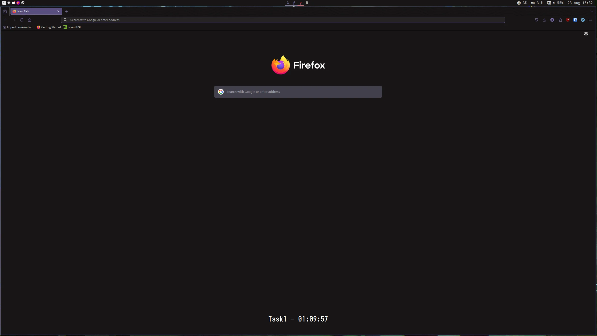

# ChronoTask

ChronoTask is a flexible, customizable task timer application designed to help you manage
your time effectively. It supports various routines like Pomodoro technique and custom
task sequences.



## Build

1. Dependencies:
    - GCC
    - Make
    - X11
    - Xinerama
    - Xft
    - SDL2
    - SDL2_mixer
    - libyaml

2. Clone the repository:

   ```bash
   git clone https://github.com/0xSilverest/chronotask.git
   cd chronotask
   ```

3. Build the main ChronoTask application:

   ```bash
   make
   ```

4. Build the control utility:

   ```bash
   make ctrl
   ```

5. (Optional) If you want to install ChronoTask system-wide:

   ```bash
   sudo make install
   ```

   This will typically install the binaries to `/usr/local/bin/`.

After building, you'll have the following executables:

- `chronoTask`: The main ChronoTask application
- `ctrl/chronotask-ctrl`: The control utility for ChronoTask

Then just:

```bash
./chronoTask
```

## Usage

To start ChronoTask:

```bash
./chronoTask [routine_name] # to run a specific routine

./chronoTask # prompts you to choose a specific routine after listing them
```

## Configuration

ChronoTask uses two main configuration files:
`config.yaml` for general settings and `routines.yaml` for defining task routines.

### Main Configuration

The main configuration file (`config.yaml`) contains the following options:

- `notification_sound`: Path to the sound file for notifications.
- `overlay_x`, `overlay_y`: Position of the overlay window. If left empty, `auto_x` and `auto_y` will be used.
- `font_size`: Size of the font used in the overlay.
- `font_name`: Name of the font to use.
- `font_weight`: Weight of the font (e.g., "Bold", "Normal").
- `routines`: Name of the routines file (without .yaml extension).
- `text_color`: Color of the text in hex format.
- `stroke_color`: Color of the text stroke in hex format.
- `target_screen`: Screen to display the overlay (0 for primary, 1 for secondary, etc.).
- `window_width`, `window_height`: Dimensions of the overlay window.
- `auto_x`, `auto_y`: Automatic positioning of the window ("left", "center", "right" for x; "top", "middle", "bottom" for y).

Example `config.yaml`:
```yaml
notification_sound: "notification.wav"
overlay_x: 0
overlay_y: 0
font_size: 24.0
font_name: "Iosevka"
font_weight: "Bold"
routines: "routines"
text_color: "#FFFFFF"
stroke_color: "#000000"
target_screen: 0
window_width: 500
window_height: 100
auto_x: "center"
auto_y: "bottom"
```

### Routines Configuration

Routines are defined in the `routines.yaml` file. Each routine consists of:

- `routine-name`: Name of the routine.
- `loop`: Number of times to repeat the routine (optional).
- `inf-loop`: Whether to loop infinitely (optional, boolean).
- `tasks`: List of tasks in the routine.
  - `name`: Name of the task.
  - `duration`: Duration of the task (e.g., "25m", "30s", "1h 30m", "3600"...).

Example `routines.yaml`:

```yaml
- routine-name: pomodoro
  loop: 4
  inf-loop: false
  tasks:
    - name: Focus Work
      duration: 25m
    - name: Short Break
      duration: 5m
    - name: Focus Work
      duration: 25m
    - name: Short Break
      duration: 5m
    - name: Focus Work
      duration: 25m
    - name: Short Break
      duration: 5m
    - name: Focus Work
      duration: 25m
    - name: Long Break
      duration: 15m

- routine-name: generic_routine
  loop: 1
  inf-loop: false
  tasks:
    - name: Task 1
      duration: 10m
    - name: Task 2
      duration: 15m
    - name: Task 3
      duration: 20m
    - name: Task 4
      duration: 5m
```

## Control Commands

ChronoTask can be controlled using the `chronotask-ctrl` command-line tool:

- `chronotask-ctrl pause`: Pause the current task
- `chronotask-ctrl resume`: Resume the paused task
- `chronotask-ctrl next`: Skip to the next task
- `chronotask-ctrl previous`: Go back to the previous task
- `chronotask-ctrl extend <minutes>`: Extend the current task by specified minutes
- `chronotask-ctrl status`: Get the current status of ChronoTask
- `chronotask-ctrl abort`: Terminate the ChronoTask program
